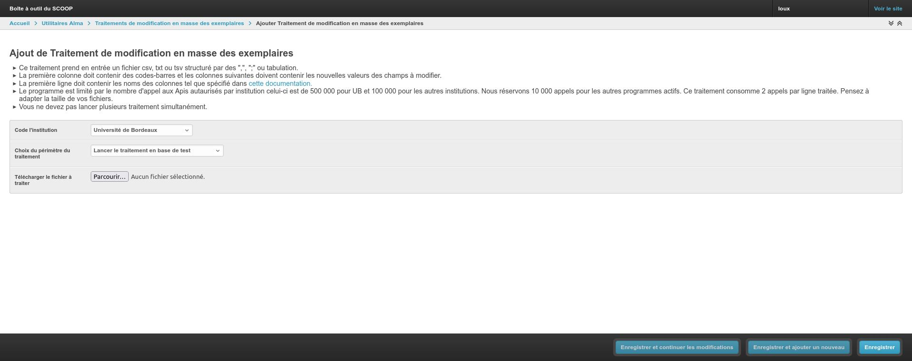

# Modification en masse des exemplaires dans Alma

Ce programme est un module Django qui permet de modifier en masse des exemplaires dans Alma à partir d'un fichier csv.
- Ce traitement prend en entrée un fichier csv, txt ou tsv structuré par des ",", ";" ou tabulation.
- La première colonne doit contenir des codes-barres et les colonnes suivantes doivent contenir les nouvelles valeurs des champs à modifier.
- La première ligne doit contenir les noms des colonnes tel que spécifié dans [cette documentation](href="https://developers.exlibrisgroup.com/alma/apis/docs/xsd/rest_item.xsd/#item_data").
- Le programme est limité par le nombre d'appel aux Apis autaurisés par institution celui-ci est de 500 000 pour UB et 100 000 pour les autres institutions. 
  Nous réservons 10 000 appels pour les autres programmes actifs. Ce traitement consomme 2 appels par ligne traitée. Pensez à adapter la taille de vos fichiers.
- VOus ne devez pas lancer plusieurs traitement simultanément.
